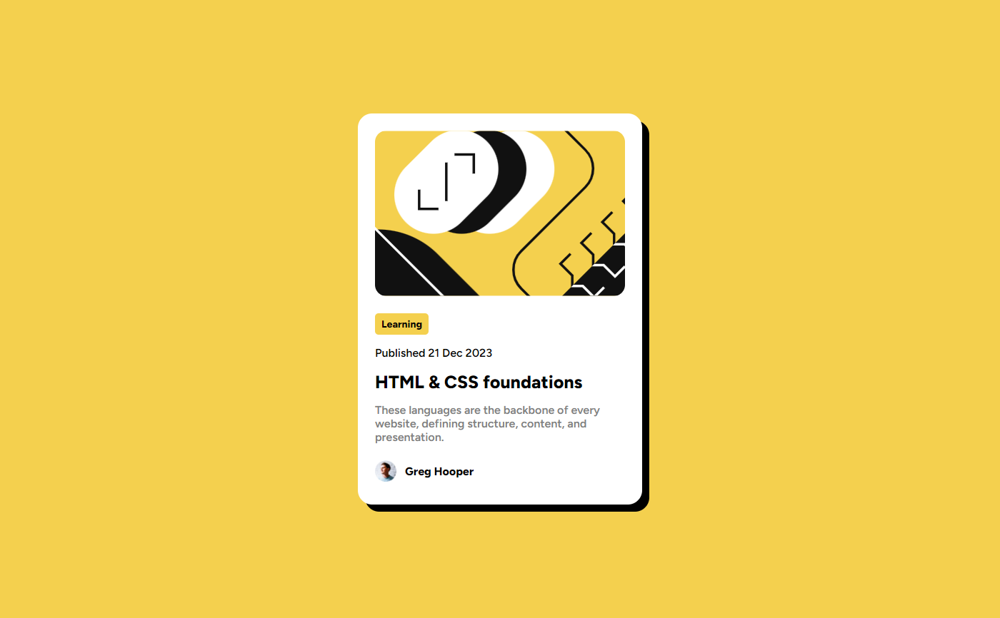

# Frontend Mentor - Blog preview card solution

This is a solution to the [Blog preview card challenge on Frontend Mentor](https://www.frontendmentor.io/challenges/blog-preview-card-ckPaj01IcS). Frontend Mentor challenges help you improve your coding skills by building realistic projects. 

## Table of contents

- [Overview](#overview)
  - [The challenge](#the-challenge)
  - [Screenshot](#screenshot)
  - [Links](#links)
- [My process](#my-process)
  - [Built with](#built-with)
  - [What I learned](#what-i-learned)
- [Author](#author)
- [Acknowledgments](#acknowledgments)

## Overview

### The challenge

Users should be able to:

- See hover and focus states for all interactive elements on the page

### Screenshot

### Links

- Live Site URL: [Blog Preview](https://rkendall300.github.io/blog-preview-card/)

## My process

### Built with

- Semantic HTML5 markup
- CSS custom properties
- Flexbox

### What I learned

My main focus of this project was not related to the difficulty of the page, but moreso to get repetition in using Github and GH-Pages to host the project. I plan on doing the rest of the level 1 Frontend Mentor projects to go through the motions of using a github repo.

## Author

- Frontend Mentor - [@rkendall300](https://www.frontendmentor.io/profile/rkendall300)

## Acknowledgments

Once again, thank you to my friend Eric for helping me start this frontend development journey! Also big thanks to @MelvinAguilar for suggesting I use flexbox/grid for centering cards on the middle of the screen like in this project. Not having to work around margins was a very nice quality of life change.
